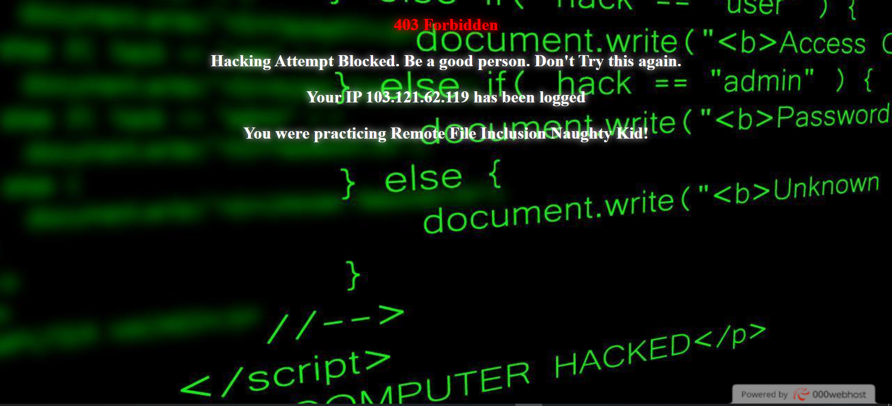
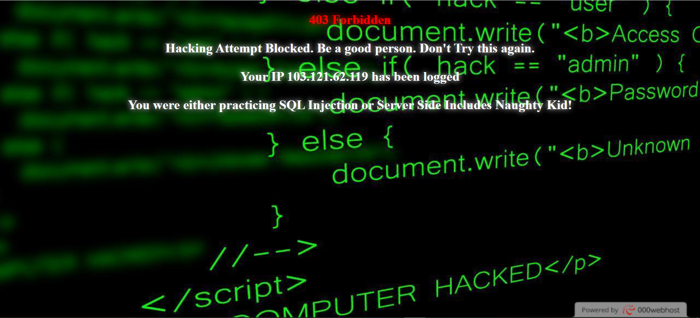
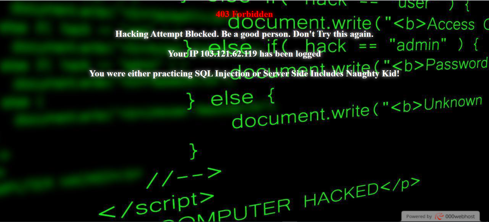

# Jarir_Personal_WAF_PHP
# A PHP Web Application Firewall.
# Scroll down to see screenshots.

# Useage:
# 1. Copy the all files to the folder where your config.php is in.
# 2. Write these lines into your config.php 
# require_once('jarir_ddos_waf.php'); require_once('jarir_sqli_ssi_rfi_lfi_xss_waf.php');
# You are safe now.

# Features:
# 1. Detects and Blocks Cross Site Scripting 
# 2. Detects and Blocks SQL Injection
# 3. Detects and Blocks Local File Inclusion
# 4. Detects and Blocks Remote File Inclusion
# 5. Detects and Blocks Server Side Includes
# 6. Prevents DDOS attacks by redirecting the attacker to another address and consuming their bandwidth drastically and making them face trouble.

# 7. For Zip Password Contact me at: jarircse16@gmail.com
# 8. HTTP 402 Payment Required
# 9. If you are good at something, never do it for free.
